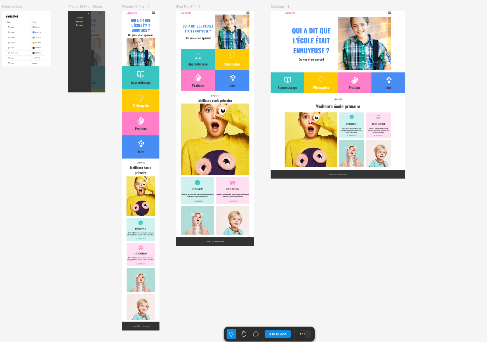

# 🎓 Education Website

This project is a modern and responsive **educational website** built with **Bootstrap 5**. It highlights the importance of education through an engaging and interactive user interface.

## 🚀 Technologies Used
- ✅ **HTML5**
- ✅ **Bootstrap 5**
- ✅ **CSS3**

## 📷 Live Preview

## 🎯 Features
- 📱 **Fully Responsive** – Optimized for mobile and desktop.
- 🎨 **Bootstrap Grid System** – Ensures a clean and structured layout.
- 📷 **Educational Images & Icons** – Enhancing the learning experience.
- 🔗 **Simple & Intuitive Navigation** – Easy access to all sections.

## 📂 Project Structure
